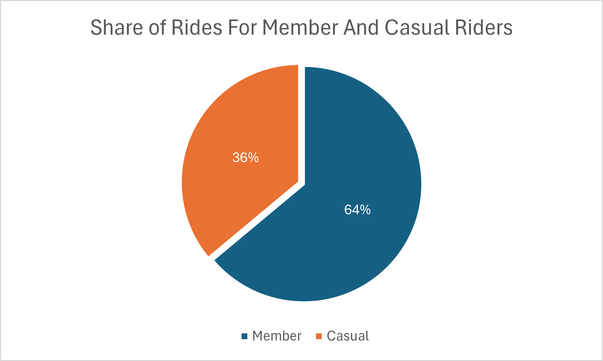
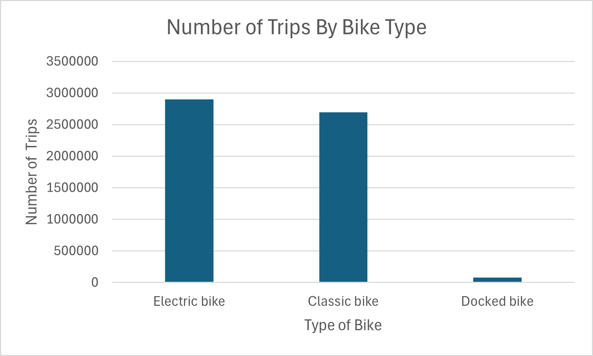
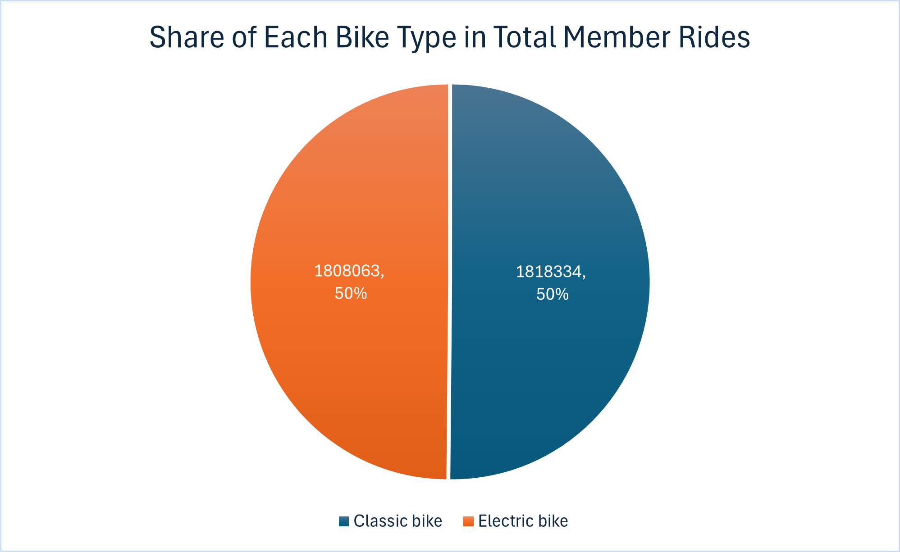
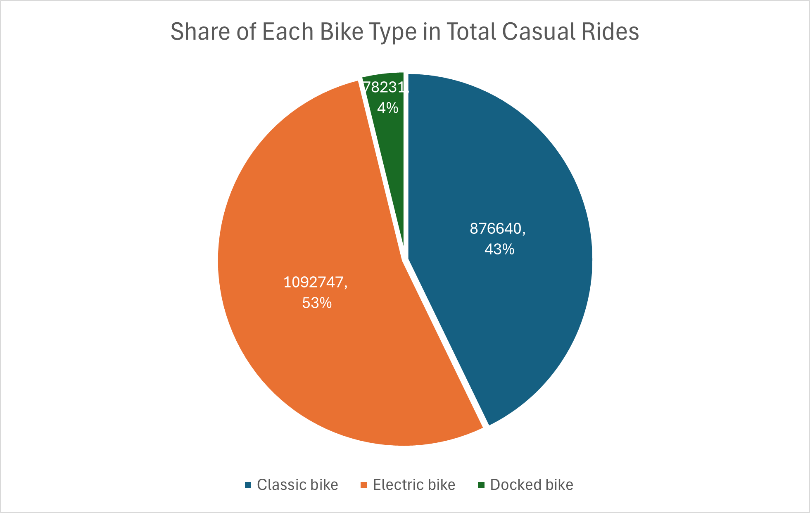
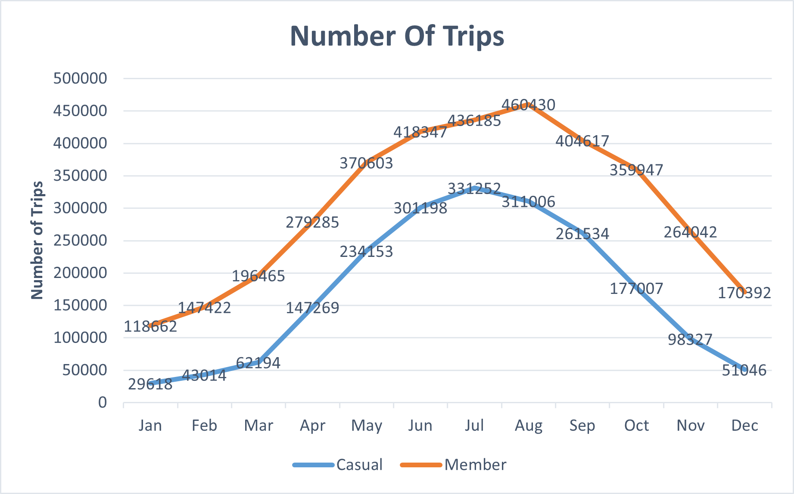
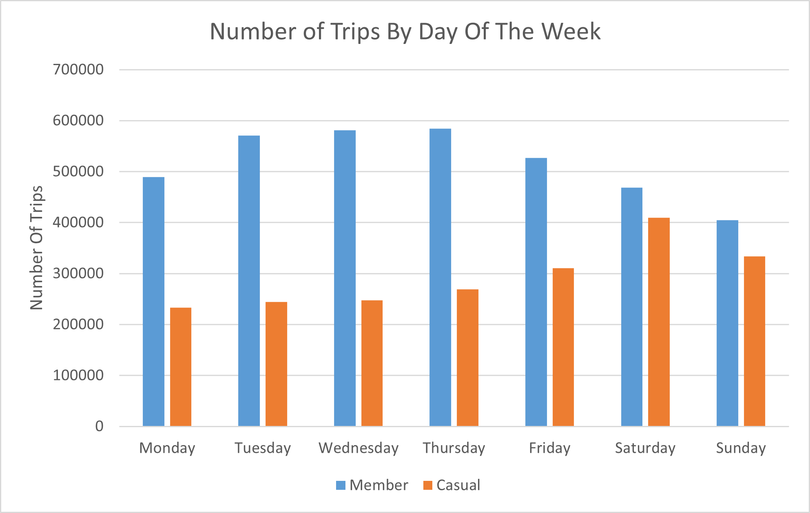
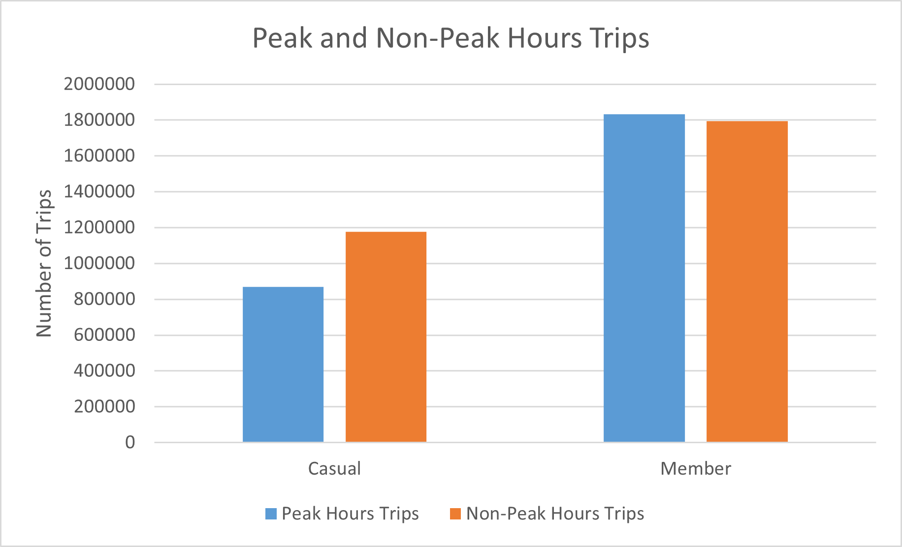

# INTRODUCTION

Welcome to the Cyclistic Bike-Share Analysis Project! This project is a comprehensive case study focusing on understanding how Cyclistic, a bike-share company in Chicago, can increase its annual memberships by analyzing the usage patterns of casual riders and annual members. As a junior data analyst at Cyclistic, this project involves exploring historical bike trip data to generate insights and develop data-driven recommendations to inform marketing strategies. The ultimate goal is to design effective marketing campaigns to convert casual riders into annual members, ensuring sustained growth and success for the company.

SQL Queries? Check them out here [SQL analysis folder](/sql_analysis/)


# BACKGROUND

This project is part of the Google Data Analytics Certification course on Coursera, which I completed as a capstone project. The course provided a solid foundation in data analysis, covering various tools and techniques that were applied in this case study. The objective of the capstone project was to demonstrate the application of data analytics skills to solve real-world business problems. You can find more information about the course [here](https://www.coursera.org/professional-certificates/google-data-analytics).

## Data
The dataset used in this project is publicly available and can be accessed [here](https://divvy-tripdata.s3.amazonaws.com/index.html). This dataset includes the historical bike trip data for Cyclistic, which was used to analyze the differences in usage patterns between casual riders and annual members.

The data used would cover rider information spanning a one-year period from January 2023 to December 2023. The data has been made available by Motivate International Inc. with [license](https://divvybikes.com/data-license-agreement) and is originally stored in separate CSV files organized by the different months of the year here.

### Data Limitations

The dataset contains some null values that were deleted and hence not used in the analysis.

## Scenario
I'm a junior data analyst working in the marketing analyst team at Cyclistic, a bike-share company in Chicago. The director of marketing believes the company’s future success depends on maximizing the number of annual memberships. Therefore, my team wants to understand how casual riders and annual members use Cyclistic bikes differently. From these insights, my team will design a new marketing strategy to convert casual riders into annual members. But first, Cyclistic executives must approve my recommendations, so they must be backed up with compelling data insights and professional data visualizations.

## Business Task
1) How do annual members and casual riders use Cyclistic bikes differently?
2) Why would casual riders buy Cyclistic annual memberships?
3) How can Cyclistic use digital media to influence casual riders to become members?


# TOOLS USED

In this project, I utilized a variety of tools to manage, analyze, visualize, and share data effectively:

- **Excel**: Used for data cleaning and transformation to prepare the dataset for analysis. Additionally, Excel was used to visualize data through bar graphs, charts, and other visual aids.
- **SQL**: Used for detailed data analysis, enabling complex queries and data manipulation.
- **PostgreSQL**: Employed for database management, ensuring efficient storage and retrieval of the bike trip data.
- **Visual Studio Code**: Utilized for database management and executing SQL queries, providing an integrated development environment.
- **Git and GitHub**: Used for version control and sharing my SQL scripts and analysis, ensuring collaboration and proper management of code versions.

# THE ANALYSIS

Each query for this project aimed at investigating specific aspects of the bike sharing data

## 1. SHARE OF RIDES FOR MEMBER AND CASUAL RIDERS
We can calculate the number and percentage of rides by the type of user.
```sql
SELECT 
    member_casual,
    COUNT(ride_id) AS no_of_trips
FROM 
    annual_data
GROUP BY
    member_casual
 ;
```
*Tablw showing the total number of rides booked by each type of user in the year 2023*
| Member Type   | Number of Rides |
|---------------|-------------|
| Casual        | 2047618     |
| Member        | 3626397     |



#### Insights
From the data, it is evident that annual members constitute a larger share of the rides compared to casual riders. Specifically, annual members accounted for approximately 64% of the total rides, while casual riders accounted for the remaining 36%. This indicates that while casual riders form a significant portion of the user base, the majority of the usage comes from annual members.

## 2. What is the bike-type preference of member and casual riders?


Here we calculate the bike-type preference for:
- a) All trips in the year (2023)
- b) Members
- c) Casual riders

```sql
--Share of each bike-type in all ride bookings

SELECT
    rideable_type,
    COUNT(ride_id) AS no_of_trips
FROM 
    annual_data
GROUP BY
    rideable_type
ORDER BY
    no_of_trips DESC;

-- Share of each bike-type in all member bookings

SELECT
    rideable_type,
    COUNT(ride_id) AS no_of_trips_members
FROM 
    annual_data
WHERE
    member_casual = 'member'
GROUP BY
    rideable_type;

-- Share of each bike-type in all non-member(casual) bookings

SELECT
    rideable_type,
    COUNT(ride_id) AS no_of_trips_casual
FROM 
    annual_data
WHERE
    member_casual = 'casual'
GROUP BY
    rideable_type;
```

####  a) All trips in the year (2023)
| Bike Type    | Number of Trips |
|--------------|-----------------|
| Electric bike | 2,900,810       |
| Classic bike  | 2,694,974       |
| Docked bike   | 78,231          |



####  b) Members
| Bike Type    | Share of Each Bike Type in Total Member Rides |
|--------------|-----------------------------------------------|
| Classic bike | 1,818,334                                     |
| Electric bike| 1,808,063                                     |



####  c) Casual Riders

| Bike Type    | Share of Each Bike Type in Total Casual Rides |
|--------------|-----------------------------------------------|
| Classic bike | 876,640                                       |
| Electric bike| 1,092,747                                     |
| Docked bike  | 78,231                                        |



#### Insights
From the analysis, it is clear that the preferences for bike types vary between members and casual riders. Overall, electric bikes are slightly more popular, with 2.9 million rides, compared to 2.69 million rides for classic bikes and a smaller number of rides for docked bikes.

Among members, the preference is nearly evenly split between electric bikes and classic bikes, each accounting for approximately 50% of the rides. This indicates that members appreciate both types of bikes equally for their commutes or leisure rides.

In contrast, casual riders show a stronger preference for electric bikes, which constitute 53% of their rides. Classic bikes follow at 43%, with docked bikes making up a small 4% of the rides. This suggests that casual riders may prefer the convenience and speed of electric bikes for their occasional use.

## 3. Question: What is the number of trips booked by members and non-members(casual) ?
We calculate the number of rides booked by members and casual riders and how does it vary:
- a) Monthly
- b) Day of the week
- c) Peak/non-peak hours

Assumption: Peak hours have been taken as 07:00 to 10:00 hrs and 16:00 to 20:00 hrs.

```sql
-- Number of trips booked by members and non-members in Januray

SELECT 
    member_casual,
    COUNT(ride_id) AS no_of_trips
FROM 
    jan
GROUP BY
    member_casual
 ;

/*
 Using same syntax as above, number of trips booked for each month was calculated by using the correct table name corresponding to each month
*/


-- Number of trips booked by members and non-members(casual) as per the day of the week
/* Note: A new column called "weekday" was created during the Data cleaning stage in which the day of the week was extracted from timestamp in "started_at" column. The "weekday" column contains day of the week as 1(Monday) to 7(Sunday).
*/

SELECT
    weekday,
    COUNT(ride_id) AS no_of_rides
FROM
    annual_data
WHERE
    member_casual = 'member'
GROUP BY
    weekday
;

SELECT
    weekday,
    COUNT(ride_id) AS no_of_rides
FROM
    annual_data
WHERE
    member_casual = 'casual'
GROUP BY
    weekday
;


-- Number of trips booked by members and non-members(casual) in peak and non-peak hours

SELECT
    member_casual,
    COUNT(ride_id) AS peak_hour_bookings
FROM 
    annual_data
WHERE
    (start_time BETWEEN '07:00:00' AND '10:00:00'
    OR start_time BETWEEN '16:00:00' AND '20:00:00')
GROUP BY
    member_casual;
```

### a) Monthly

*Table showing monthly trips done by each type of user*

|  | Jan    | Feb    | Mar    | Apr    | May    | Jun    | Jul    | Aug    | Sep    | Oct    | Nov    | Dec    |
|-----------------|--------|--------|--------|--------|--------|--------|--------|--------|--------|--------|--------|--------|
| Casual          | 29,618 | 43,014 | 62,194 | 147,269| 234,153| 301,198| 331,252| 311,006| 261,534| 177,007| 98,327 | 51,046 |
| Member          | 118,662| 147,422| 196,465| 279,285| 370,603| 418,347| 436,185| 460,430| 404,617| 359,947| 264,042| 170,392|





### b) Day of the week

*Table showing the number of trips by each type of user for each day of the week*

|  | Monday | Tuesday | Wednesday | Thursday | Friday | Saturday | Sunday |
|---------|--------|---------|-----------|----------|--------|----------|--------|
| Member  | 489,564 | 570,695 | 581,176   | 584,426  | 526,828| 468,987  | 404,721|
| Casual  | 233,218 | 244,320 | 247,488   | 269,079  | 310,318| 409,210  | 333,985|




### c) Peak/non-peak hours

*Table showing the number of trips by each type of user for peak and non-peak  hours*

|                  | Peak Hours Trips | Non-Peak Hours Trips |
|------------------|------------------|----------------------|
| Casual           | 870,263          | 1,177,355            |
| Member           | 1,833,399        | 1,792,998            |




#### Insights

a) Monthly 

- Casual Riders:

Rides increase from January (29,618) to a peak in July (331,252), then decline to December (51,046).

- Member Riders:

Consistently more rides than casual riders, peaking in August (460,430), with a decline to December (170,392).

Both casual and member riders show higher activity in warmer months, suggesting seasonal influence.

b) Day of the Week

- Casual Riders:

More rides on weekends, especially Saturday (409,210) and Sunday (333,985), indicating leisure use.

- Member Riders:

Stable weekday rides, peaking mid-week (Wednesday: 581,176; Thursday: 584,426), with fewer rides on Sunday (404,721), indicating commuting use.

c) Peak/Non-Peak Hours

- Casual Riders:

Prefer non-peak hours (1,177,355) over peak hours (870,263), likely for leisure.

- Member Riders:

Slightly more rides during peak hours (1,833,399) than non-peak hours (1,792,998), reflecting commuting patterns.

/*Summary
These insights illustrate clear distinctions between casual and member riders in terms of their biking habits. Casual riders show a preference for leisure and recreational use, especially during weekends and non-peak hours, while member riders use bike-sharing services more consistently for commuting purposes, with a higher volume of rides during peak hours and weekdays.*/

## 4. Question: 


# WHAT I LEARNED

