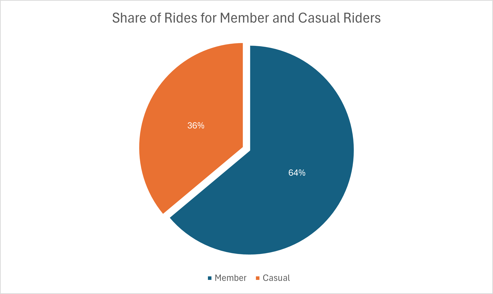

# INTRODUCTION

Welcome to the Cyclistic Bike-Share Analysis Project! This project is a comprehensive case study focusing on understanding how Cyclistic, a bike-share company in Chicago, can increase its annual memberships by analyzing the usage patterns of casual riders and annual members. As a junior data analyst at Cyclistic, this project involves exploring historical bike trip data to generate insights and develop data-driven recommendations to inform marketing strategies. The ultimate goal is to design effective marketing campaigns to convert casual riders into annual members, ensuring sustained growth and success for the company.

SQL Queries? Check them out here [SQL analysis folder](/sql_analysis/)


# BACKGROUND

This project is part of the Google Data Analytics Certification course on Coursera, which I completed as a capstone project. The course provided a solid foundation in data analysis, covering various tools and techniques that were applied in this case study. The objective of the capstone project was to demonstrate the application of data analytics skills to solve real-world business problems. You can find more information about the course [here](https://www.coursera.org/professional-certificates/google-data-analytics).

## Data
The dataset used in this project is publicly available and can be accessed [here](https://divvy-tripdata.s3.amazonaws.com/index.html). This dataset includes the historical bike trip data for Cyclistic, which was used to analyze the differences in usage patterns between casual riders and annual members.

The data used would cover rider information spanning a one-year period from January 2023 to December 2023. The data has been made available by Motivate International Inc. with [license](https://divvybikes.com/data-license-agreement) and is originally stored in separate CSV files organized by the different months of the year here.

### Data Limitations

The dataset contains some null values that were deleted and hence not used in the analysis.

## Scenario
I'm a junior data analyst working in the marketing analyst team at Cyclistic, a bike-share company in Chicago. The director of marketing believes the company’s future success depends on maximizing the number of annual memberships. Therefore, my team wants to understand how casual riders and annual members use Cyclistic bikes differently. From these insights, my team will design a new marketing strategy to convert casual riders into annual members. But first, Cyclistic executives must approve my recommendations, so they must be backed up with compelling data insights and professional data visualizations.

## Business Task
1) How do annual members and casual riders use Cyclistic bikes differently?
2) Why would casual riders buy Cyclistic annual memberships?
3) How can Cyclistic use digital media to influence casual riders to become members?


# TOOLS USED

In this project, I utilized a variety of tools to manage, analyze, visualize, and share data effectively:

- **Excel**: Used for data cleaning and transformation to prepare the dataset for analysis. Additionally, Excel was used to visualize data through bar graphs, charts, and other visual aids.
- **SQL**: Used for detailed data analysis, enabling complex queries and data manipulation.
- **PostgreSQL**: Employed for database management, ensuring efficient storage and retrieval of the bike trip data.
- **Visual Studio Code**: Utilized for database management and executing SQL queries, providing an integrated development environment.
- **Git and GitHub**: Used for version control and sharing my SQL scripts and analysis, ensuring collaboration and proper management of code versions.

# THE ANALYSIS

Each query for this project aimed at investigating specific aspects of the bike sharing data

## 1. SHARE OF RIDES FOR MEMBER AND CASUAL RIDERS
We can calculate the number and percentage of rides by the type of user.
```sql
SELECT 
    member_casual,
    COUNT(ride_id) AS no_of_trips
FROM 
    annual_data
GROUP BY
    member_casual
 ;
```
*Tablw showing the total number of rides booked by each type of user in the year 2023*
| Member Type   | Number of Rides |
|---------------|-------------|
| Casual        | 2047618     |
| Member        | 3626397     |



#### Insights
From the data, it is evident that annual members constitute a larger share of the rides compared to casual riders. Specifically, annual members accounted for approximately 64% of the total rides, while casual riders accounted for the remaining 36%. This indicates that while casual riders form a significant portion of the user base, the majority of the usage comes from annual members.

## 2. What is the bike-type preference of member and casual riders?


Calculated the bike-type preference for:
- a) All trips booked in the year (2023)
- b) Members 
- c) Casual riders

```sql
--Share of each bike-type in all ride bookings

SELECT
    rideable_type,
    COUNT(ride_id) AS no_of_trips
FROM 
    annual_data
GROUP BY
    rideable_type
ORDER BY
    no_of_trips DESC;

-- Share of each bike-type in all member bookings

SELECT
    rideable_type,
    COUNT(ride_id) AS no_of_trips_members
FROM 
    annual_data
WHERE
    member_casual = 'member'
GROUP BY
    rideable_type;

-- Share of each bike-type in all non-member(casual) bookings

SELECT
    rideable_type,
    COUNT(ride_id) AS no_of_trips_casual
FROM 
    annual_data
WHERE
    member_casual = 'casual'
GROUP BY
    rideable_type;
```

####  a) All trips in the year (2023)
| Bike Type    | Number of Trips |
|--------------|-----------------|
| Electric bike | 2,900,810       |
| Classic bike  | 2,694,974       |
| Docked bike   | 78,231          |


####  b) Members
| Bike Type    | Share of Each Bike Type in Total Member Rides |
|--------------|-----------------------------------------------|
| Classic bike | 1,818,334                                     |
| Electric bike| 1,808,063                                     |


####  c) Casual Riders

| Bike Type    | Share of Each Bike Type in Total Casual Rides |
|--------------|-----------------------------------------------|
| Classic bike | 876,640                                       |
| Electric bike| 1,092,747                                     |
| Docked bike  | 78,231                                        |


#### Insights
From the analysis, it is clear that the preferences for bike types vary between members and casual riders. Overall, electric bikes are slightly more popular, with 2.9 million rides, compared to 2.69 million rides for classic bikes and a smaller number of rides for docked bikes.

Among members, the preference is nearly evenly split between electric bikes and classic bikes, each accounting for approximately 50% of the rides. This indicates that members appreciate both types of bikes equally for their commutes or leisure rides.

In contrast, casual riders show a stronger preference for electric bikes, which constitute 53% of their rides. Classic bikes follow at 43%, with docked bikes making up a small 4% of the rides. This suggests that casual riders may prefer the convenience and speed of electric bikes for their occasional use.

## 3. Question: What is the number of trips booked by members and non-members(casual) ?
Calculated the number of rides booked by members and casual riders and how does it vary based on:
- a) Month
- b) Day of the week
- c) Peak/non-peak hours

Assumption: Peak hours have been taken as 07:00 to 10:00 hrs and 16:00 to 20:00 hrs.

```sql
-- Number of trips booked by members and non-members in Januray

SELECT 
    member_casual,
    COUNT(ride_id) AS no_of_trips
FROM 
    jan
GROUP BY
    member_casual
 ;

/*
 Using same syntax as above, number of trips booked for each month was calculated by using the correct table name corresponding to each month
*/


-- Number of trips booked by members and non-members(casual) as per the day of the week
/* Note: A new column called "weekday" was created during the Data cleaning stage in which the day of the week was extracted from timestamp in "started_at" column. The "weekday" column contains day of the week as 1(Monday) to 7(Sunday).
*/

SELECT
    weekday,
    COUNT(ride_id) AS no_of_rides
FROM
    annual_data
WHERE
    member_casual = 'member'
GROUP BY
    weekday
;

SELECT
    weekday,
    COUNT(ride_id) AS no_of_rides
FROM
    annual_data
WHERE
    member_casual = 'casual'
GROUP BY
    weekday
;


-- Number of trips booked by members and non-members(casual) in peak and non-peak hours

SELECT
    member_casual,
    COUNT(ride_id) AS peak_hour_bookings
FROM 
    annual_data
WHERE
    (start_time BETWEEN '07:00:00' AND '10:00:00'
    OR start_time BETWEEN '16:00:00' AND '20:00:00')
GROUP BY
    member_casual;
```

### a) Monthly

*Table showing monthly trips done by each type of user*

|  | Jan    | Feb    | Mar    | Apr    | May    | Jun    | Jul    | Aug    | Sep    | Oct    | Nov    | Dec    |
|-----------------|--------|--------|--------|--------|--------|--------|--------|--------|--------|--------|--------|--------|
| Casual          | 29,618 | 43,014 | 62,194 | 147,269| 234,153| 301,198| 331,252| 311,006| 261,534| 177,007| 98,327 | 51,046 |
| Member          | 118,662| 147,422| 196,465| 279,285| 370,603| 418,347| 436,185| 460,430| 404,617| 359,947| 264,042| 170,392|


### b) Day of the week

*Table showing the number of trips by each type of user for each day of the week*

|  | Monday | Tuesday | Wednesday | Thursday | Friday | Saturday | Sunday |
|---------|--------|---------|-----------|----------|--------|----------|--------|
| Member  | 489,564 | 570,695 | 581,176   | 584,426  | 526,828| 468,987  | 404,721|
| Casual  | 233,218 | 244,320 | 247,488   | 269,079  | 310,318| 409,210  | 333,985|


### c) Peak/non-peak hours

*Table showing the number of trips by each type of user for peak and non-peak  hours*

|                  | Peak Hours Trips | Non-Peak Hours Trips |
|------------------|------------------|----------------------|
| Casual           | 870,263          | 1,177,355            |
| Member           | 1,833,399        | 1,792,998            |


#### Insights

a) Monthly 

- Casual Riders:

Rides increase from January (29,618) to a peak in July (331,252), then decline to December (51,046).

- Member Riders:

Consistently more rides than casual riders, peaking in August (460,430), with a decline to December (170,392).

Both casual and member riders show higher activity in warmer months, suggesting seasonal influence.

b) Day of the Week

- Casual Riders:

More rides on weekends, especially Saturday (409,210) and Sunday (333,985), indicating leisure use.

- Member Riders:

Stable weekday rides, peaking mid-week (Wednesday: 581,176; Thursday: 584,426), with fewer rides on Sunday (404,721), indicating commuting use.

c) Peak/Non-Peak Hours

- Casual Riders:

Prefer non-peak hours (1,177,355) over peak hours (870,263), likely for leisure.

- Member Riders:

Slightly more rides during peak hours (1,833,399) than non-peak hours (1,792,998), reflecting commuting patterns.


## 4. Question: What is the average trip duration for each user type?

Calculated the average trip duration and how does it vary based on:
- a) Type of user
- b) Month
- c) Day of the week

```sql
-- Average trip duration by members and non-members(casual) overall

SELECT
    member_casual,
    ROUND(AVG(ride_length_mins),2) AS average_trip_duration
FROM 
    annual_data
GROUP BY
    member_casual
ORDER BY
    average_trip_duration DESC;


-- Average trip duration monthly

SELECT
    member_casual,
    ROUND(AVG(ride_length_mins),2) AS average_trip_duration
FROM 
    jan
GROUP BY
    member_casual
ORDER BY
    average_trip_duration DESC;

/*
 Using same syntax as above, average ride duration for each month was calculated by using the correct table name corresponding to each month
*/


-- Average trip duration week per the day of the week by members and non-members(casual)

-- Members

SELECT
    weekday,
    ROUND(AVG(ride_length_mins),2) AS average_trip_duration
FROM 
    annual_data
WHERE
    member_casual = 'member'
GROUP BY
    weekday;

-- Non-members(Casual)

SELECT
    weekday,
    ROUND(AVG(ride_length_mins),2) AS average_trip_duration
FROM 
    annual_data
WHERE
    member_casual = 'casual'
GROUP BY
    weekday;
```

a) Type of User

*Average Trip Duration for All Trips Booked in 2023*

| User Type | Average Trip Duration (mins) |
|-----------|------------------------------|
| Casual    | 21.23                        |
| Member    | 12.09                        |


b) Month

*Table showing the average trip duration in minutes for each user type across each month in the year 2023*

|         | Jan   | Feb   | Mar   | Apr   | May   | Jun   | Jul   | Aug   | Sep   | Oct   | Nov   | Dec   |
|---------|-------|-------|-------|-------|-------|-------|-------|-------|-------|-------|-------|-------|
| Casual  | 14.83 | 16.63 | 16.02 | 21.33 | 22.66 | 22.32 | 23.59 | 22.67 | 21.26 | 19.08 | 16.17 | 14.99 |
| Member  | 9.96  | 10.47 | 10.2  | 11.47 | 12.58 | 12.86 | 13.21 | 13.18 | 12.64 | 11.57 | 11.02 | 10.92 |


c) Day of the week

*Table showing the average trip duration in minutes for each user type across each day of the week in the year 2023*

|          | Monday | Tuesday | Wednesday | Thursday | Friday | Saturday | Sunday |
|----------|--------|---------|-----------|----------|--------|----------|--------|
| Member   | 11.48  | 11.61   | 11.54     | 11.61    | 12.03  | 13.48    | 13.48  |
| Casual   | 20.86  | 19.02   | 18.11     | 18.53    | 20.59  | 24.04    | 24.77  |


#### Insights

a) Type of User

Casual users have a longer average trip duration compared to members, indicating a difference in trip behavior between user types.

b) Month

Trip durations vary across months, with generally longer durations observed during summer months for both casual and member users.

c) Day of the Week

There is a noticeable difference in trip durations between weekdays and weekends, with weekends showing longer trip durations, especially for casual users.


- Casual users consistently show longer trip durations compared to members.
- Trip durations vary significantly across months, peaking during summer.
- Weekends exhibit longer trip durations compared to weekdays, particularly for casual users.

## 5. Question: Which are the busiest stations for members and casual riders?

Calculated the Top 10 busiest stations based on the number of rides starting from a station for:

a) Members

b) Casual Riders

```sql
-- Top 10 busiest stations for members

SELECT
    start_station_name,
    COUNT(ride_id) AS bookings
FROM 
    annual_data
WHERE
    start_station_name IS NOT NULL
    AND member_casual = 'member'
GROUP BY
    start_station_name
ORDER BY
    bookings DESC
LIMIT 10;


-- Top 10 busiest stations for non-members(casuals)

SELECT
    start_station_name,
    COUNT(ride_id) AS bookings
FROM 
    annual_data
WHERE
    start_station_name IS NOT NULL
    AND member_casual = 'casual'
GROUP BY
    start_station_name
ORDER BY
    bookings DESC
LIMIT 10;
```
a) Members

*Top 10 busiest stations for ride bookings by members in the year 2023*
| Station Name         | Rides started |
|----------------------------|----------|
| Clinton St & Washington Blvd | 26129   |
| Kingsbury St & Kinzie St     | 26076   |
| Clark St & Elm St            | 24885   |
| Wells St & Concord Ln        | 21340   |
| Clinton St & Madison St      | 20507   |
| Wells St & Elm St            | 20313   |
| University Ave & 57th St     | 19847   |
| Broadway & Barry Ave         | 18870   |
| Loomis St & Lexington St     | 18857   |

c) Casual Riders
*Top 10 busiest stations for ride bookings by casual riders in the year 2023*

| Station Name                          | Rides Started |
|---------------------------------------------|----------|
| Streeter Dr & Grand Ave                     | 46009    |
| DuSable Lake Shore Dr & Monroe St           | 30472    |
| Michigan Ave & Oak St                       | 22653    |
| DuSable Lake Shore Dr & North Blvd          | 20331    |
| Millennium Park                             | 20202    |
| Shedd Aquarium                              | 17769    |
| Theater on the Lake                         | 16354    |
| Dusable Harbor                              | 15483    |
| Wells St & Concord Ln                       | 12153    |


# **Insights**

### **1) Overall Usage Patterns**

   **a) Higher Ride Volume Among Members:**

- Annual members account for a significantly larger share of rides compared to casual riders, with members constituting about 64% of the total rides. This indicates that while casual riders form a significant portion of the user base, the majority of the usage comes from annual members.

### **2) Bike Type Preferences**

   **a) Bike Type Preferences Vary by User Type:**

- Electric bikes are the most popular overall, with 2.9 million rides, followed closely by classic bikes with 2.69 million rides.

- Among members, the preference is nearly evenly split between electric bikes and classic bikes, each accounting for about 50% of the rides.

- Casual riders show a stronger preference for electric bikes, which constitute 53% of their rides, indicating a tendency towards the convenience and speed of electric bikes for occasional use.

### **3) Temporal Usage Patterns**

   **a) Monthly Trends:**

  - Both casual and member riders show increased activity during the warmer months, peaking in the summer (July for casual riders and August for members). This seasonal trend suggests that marketing efforts should be intensified during these months to maximize engagement and potential conversions.

  - Casual riders exhibit a sharper increase in rides during these months, likely due to tourism and recreational use.

  **b) Weekly Trends:**

  - Casual riders prefer weekends, especially Saturdays and Sundays, reflecting leisure use. This contrasts with members who show consistent usage across weekdays, peaking mid-week, indicative of routine commutes.

  - This highlights the potential for weekend-focused promotions and events to convert casual riders who are more active during these times.

  **c) Peak and Non-Peak Hours:**

   - Casual riders prefer non-peak hours, likely reflecting leisure use outside of commuting times.
   - Members have a balanced distribution between peak and non-peak hours, consistent with commuting patterns.
   - Marketing campaigns can target non-peak hours for casual riders, offering incentives to use the service during these times.

### **4) Average Trip Duration**

 **a) Longer Trips for Casual Riders:**

   - Casual riders have a longer average trip duration (21.23 minutes) compared to members (12.09 minutes).

   - Casual riders' trips are longer during weekends, especially Saturdays and Sundays, further supporting the leisure use hypothesis.

   - Members' trip durations are more consistent but peak slightly on weekends, suggesting occasional leisure use in addition to commuting.

### **5) Busiest Stations**

   **a) Members' Top Stations:**

   - Key stations for members are dispersed across the city, with Clinton St & Washington Blvd and Kingsbury St & Kinzie St being the busiest. These stations likely serve as major commuting hubs.

   - Stations near commercial and residential areas like Clark St & Elm St and Wells St & Concord Ln also show high usage.

   **b) Casual Riders' Top Stations:**

   - Casual riders favor stations near tourist attractions and recreational areas, with Streeter Dr & Grand Ave being the busiest, followed by DuSable Lake Shore Dr & Monroe St and Millennium Park.

   - This preference highlights the importance of these locations for attracting casual riders and suggests a focus on these areas for targeted marketing efforts to convert these riders into members.

## Strategic Recommendations

Based on the analysis of Cyclistic's bike-share data, here are the key strategic recommendations to increase annual memberships and optimize the marketing strategy:

### 1. **Leverage Peak Usage Months and Days**

- **Promote Memberships During Peak Months:** Focus marketing efforts on the months of July and August, which have the highest usage for both casual and member riders. Offer special membership promotions during these peak months to convert casual riders.
- **Weekend Promotions:** Target casual riders with weekend-specific promotions, as data shows higher usage by casual riders on Saturdays and Sundays. Highlight the benefits of membership for weekend activities.

### 2. **Focus on Popular Bike Types**

- **Electric Bikes Promotion:** Given that electric bikes are popular among both casual riders (53% of rides) and members (50% of rides), promote the convenience and benefits of electric bikes in membership plans.
- **Classic Bikes Incentives:** Offer incentives for using classic bikes, which are also widely used, to balance the demand and ensure availability of electric bikes.

### 3. **Optimize Station Locations**

- **Busiest Stations for Casual Riders:** Enhance facilities and bike availability at the top stations for casual riders, such as Streeter Dr & Grand Ave and DuSable Lake Shore Dr & Monroe St. Consider placing promotional materials and membership sign-up kiosks at these locations.
- **Busiest Stations for Members:** Ensure efficient service and quick turnover at the busiest stations for members, like Clinton St & Washington Blvd and Kingsbury St & Kinzie St, to maintain high satisfaction and encourage renewals.

### 4. **Time-Based Promotions**

- **Peak Hour Offers:** With members having slightly more rides during peak hours (07:00-10:00 and 16:00-20:00), consider offering peak hour incentives or discounts for memberships.
- **Non-Peak Hour Engagement:** Casual riders prefer non-peak hours. Develop marketing campaigns that highlight off-peak hour benefits of memberships, such as flexibility and availability.

### 5. **Highlight Longer Average Trip Durations**

- **Casual Riders Trip Duration:** Since casual riders have longer average trip durations (21.23 mins) compared to members (12.09 mins), create marketing messages that emphasize unlimited ride time benefits for members, appealing to casual riders who enjoy longer trips.
- **Seasonal Trip Duration Trends:** Capitalize on the increased trip durations during summer months by promoting long-ride benefits in membership plans.

### 6. **Day-Specific Marketing**

- **Weekday vs Weekend Usage:** Tailor marketing strategies based on the distinct usage patterns. Promote weekday commuting benefits to casual riders, while emphasizing weekend leisure and recreational benefits to convert weekend casual riders to members.

### 7. **Enhanced User Experience**

- **Upgrade and Maintain Popular Bike Types:** Focus on maintaining and upgrading the fleet, especially electric bikes, which are highly favored by both user types.
- **Improve Availability at Key Stations:** Ensure high bike availability at stations with the highest traffic to improve user satisfaction and encourage membership sign-ups.

By implementing these recommendations, Cyclistic can effectively target casual riders, highlighting the specific benefits and conveniences of becoming an annual member, thus driving membership growth.

# Learnings

This project provided an invaluable opportunity to enhance my skills and knowledge across various aspects of data analysis, database management, and collaboration tools. Here are the key learnings from this project:

### 1. **Working with Big Datasets**

- **Handling Large Volumes of Data:** I learned how to efficiently manage and analyze large datasets, ensuring optimal performance and accuracy. This involved developing strategies for data extraction, transformation, and loading (ETL) processes.
- **Data Cleaning Techniques:** I improved my data cleaning skills, including handling missing values, correcting data types, and removing duplicates to ensure data integrity and reliability.

### 2. **Database Management in PostgreSQL**

- **Database Design and Management:** I gained hands-on experience in designing and managing databases using PostgreSQL.
- **SQL Queries:** I enhanced my proficiency in writing complex SQL queries to extract meaningful insights from the data.

### 3. **Data Analysis Tools**

- **Excel for Data Analysis:** I utilized Excel for initial data exploration and analysis, leveraging its powerful functions, and charting capabilities to identify trends and patterns.
- **PostgreSQL for Advanced Analysis:** PostgreSQL was instrumental for handling more advanced data manipulation and analysis tasks, allowing for efficient querying and processing of large datasets.

### 4. **Coding and Development Environments**

- **Visual Studio Code:** I used Visual Studio Code as my primary development environment, benefiting from its robust features such as syntax highlighting, debugging, and extensions for SQL and data analysis.
- **Version Control with Git and GitHub:** I practiced version control using Git and GitHub, learning how to effectively manage code changes, collaborate with team members, and maintain a clean project history through commits and branches.

### 5. **Data Visualization and Reporting**

- **Visualizing Data Insights:** I learned how to create compelling visualizations to communicate data insights effectively. This included using charting capabilities in Excel.
- **Creating Reports:** I developed skills in compiling and presenting data analysis results in a clear and concise manner, ensuring that insights are easily understandable and actionable for stakeholders.

### 6. **Project Management and Collaboration**

- **Collaborative Development:** Working with GitHub, I experienced the benefits of collaborative development, including code reviews, issue tracking, and collaborative problem-solving.
- **Project Documentation:** I understood the importance of maintaining comprehensive project documentation, including README files, code comments, and detailed reports to facilitate knowledge sharing and project continuity.

This project was a comprehensive learning experience, reinforcing my data analysis and database management skills while providing practical insights into the tools and techniques used in real-world data projects.


